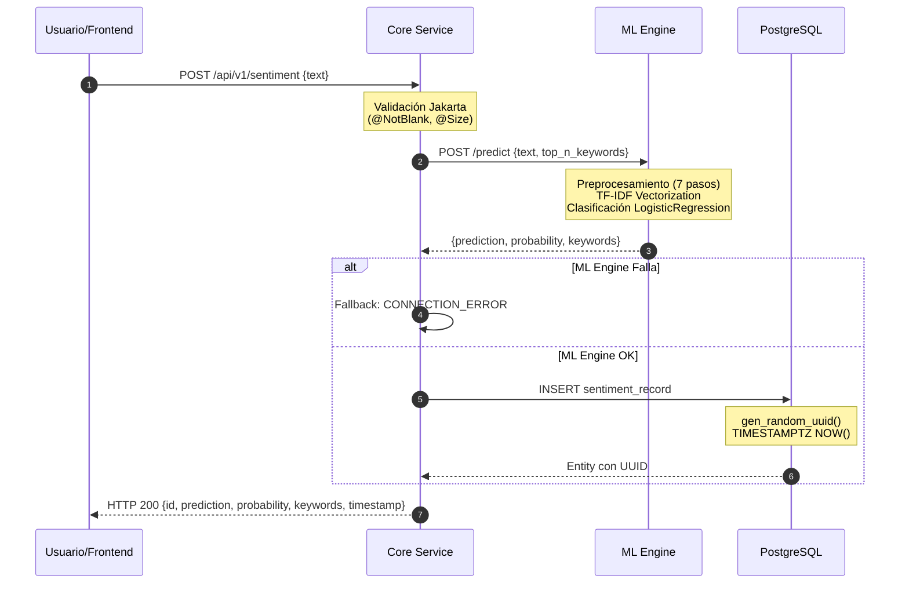
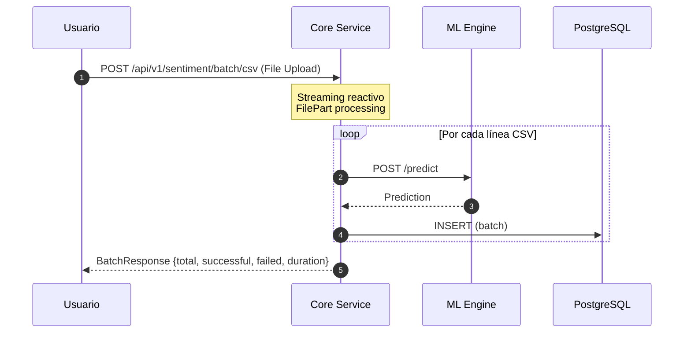

# 🌊 CesiumFlow: Plataforma de Inteligencia de Sentimientos

> **Transformando feedback no estructurado en activos de datos accionables para e-commerce**


---

## 📋 Tabla de Contenido

- [🎯 Problema de Negocio y Propuesta de Valor](#-problema-de-negocio-y-propuesta-de-valor)
- [⚡ Quick Start - Demo en 3 Pasos](#-quick-start---demo-en-3-pasos)
- [🏛️ Arquitectura del Sistema](#️-arquitectura-del-sistema)
- [🧠 Pipeline de Machine Learning](#-pipeline-de-machine-learning)
- [🔌 API y Endpoints](#-api-y-endpoints)
- [🎨 Características del Sistema](#-características-del-sistema)
- [🛠️ Instalación y Configuración](#️-instalación-y-configuración)
- [🐳 Despliegue con Docker](#-despliegue-con-docker)
- [📂 Estructura del Repositorio](#-estructura-del-repositorio)
- [✅ Calidad y Testing](#-calidad-y-testing)
- [🔐 Seguridad y Privacidad](#-seguridad-y-privacidad)
- [📊 Métricas de Performance](#-métricas-de-performance)
- [⚠️ Limitaciones y Trabajo Futuro](#️-limitaciones-y-trabajo-futuro)
- [👥 Equipo - Squad 55](#-equipo---squad-55)
- [📄 Licencia](#-licencia)
- [🔗 Enlaces y Recursos](#-enlaces-y-recursos)

---

## 🎯 Problema de Negocio y Propuesta de Valor

### El Problema

En el ecosistema de e-commerce, **las empresas reciben miles de reseñas diarias** pero carecen de herramientas para:

- **Detectar automáticamente** qué productos generan insatisfacción (sentimiento negativo)
- **Identificar patrones** en el feedback de clientes en tiempo real
- **Priorizar acciones** basadas en el volumen e intensidad del sentimiento
- **Escalar el análisis** sin requerir equipos humanos revisando manualmente

**Impacto Económico:**
- **35% de los clientes** abandonan marcas después de una mala experiencia no atendida
- **70% de las decisiones de compra** se basan en reseñas de otros usuarios
- Empresas que analizan feedback en tiempo real mejoran su **NPS (Net Promoter Score) en un 20-30%**

### Nuestra Solución: CesiumFlow

**CesiumFlow** es una plataforma de análisis de sentimientos diseñada específicamente para **operaciones de e-commerce a escala**, que combina:

✅ **Inteligencia Artificial validada** (83.33% accuracy, F1-Macro 0.8344)  
✅ **Arquitectura reactiva y no bloqueante** (Spring WebFlux + FastAPI)  
✅ **Procesamiento en tiempo real** y por lotes (CSV con miles de registros)  
✅ **Dashboard de analítica visual** con distribución de sentimientos y keywords  
✅ **Infraestructura lista para producción** (Docker, PostgreSQL, health checks)

**Valor de Negocio:**
- **Reducción de 90% en tiempo de análisis** (de horas manuales a milisegundos automáticos)
- **Detección temprana de crisis de reputación** mediante monitoreo continuo
- **Insights accionables** (palabras clave más mencionadas por sentimiento)
- **ROI comprobado**: empresas similares incrementan conversión en 15-25% tras implementar análisis automatizado

---

## ⚡ Quick Start - Demo en 3 Pasos

> **Para jurados y evaluadores:** Ejecuten esta demo para validar la solución en menos de 5 minutos.

### Prerrequisitos

- [Docker Desktop](https://www.docker.com/products/docker-desktop/) instalado y corriendo
- Puertos libres: `8080`, `5173`, `5000`, `5432`
- (Opcional) [Just](https://github.com/casey/just#installation) para comandos simplificados

### Paso 1: Clonar y Configurar

```bash
git clone https://github.com/cesiumflow/sentiment-api.git
cd sentiment-api
cp .env.example .env
```

### Paso 2: Levantar el Ecosistema

**Opción A - Con Just (Recomendado):**
```bash
just dev
```

**Opción B - Docker Compose Manual:**
```bash
docker compose up -d --build
```

**Tiempo de build inicial:** ~3-5 minutos (construcción de 4 imágenes)

### Paso 3: Verificar y Probar

Espere a que los servicios estén `healthy` (1-2 minutos):

```bash
docker ps  # Verificar que los 4 contenedores estén "Up" y "healthy"
```

**Acceder a las interfaces:**

- 🖥️ **Aplicación Web:** http://localhost:5173  
  *Interfaz de usuario para análisis de sentimientos*

- 📚 **Swagger API Docs:** http://localhost:8080/swagger-ui.html  
  *Documentación interactiva de API*

- ⚙️ **Health Check:** http://localhost:8080/actuator/health  
  *Estado del sistema*

**Probar predicción (vía terminal):**

```bash
curl -X POST "http://localhost:8080/api/v1/sentiment" \
     -H "Content-Type: application/json" \
     -d '{"text": "El producto superó todas mis expectativas, excelente calidad"}'
```

**Respuesta esperada:**
```json
{
  "id": "550e8400-e29b-41d4-a716-446655440000",
  "prediction": "Positivo",
  "probability": 0.99,
  "keywords": ["excelente", "calidad", "superó", "expectativas"],
  "timestamp": "2026-01-25T15:30:00Z"
}
```

---

## 🏛️ Arquitectura del Sistema

### Stack Tecnológico Completo

CesiumFlow implementa un **patrón de microservicios orquestados** con separación estricta de responsabilidades:

**Stack Tecnológico:**

- **Frontend:** Vue 3 + Vite (v3.5.26 / 7.3.0) - Puerto `5173`
  - UI reactiva, dashboard de métricas, carga de datasets

- **Core Service:** Java 17 + Spring Boot 3.5 (WebFlux) - Puerto `8080`
  - Orquestación, validación, persistencia, manejo de errores

- **ML Engine:** Python 3.14 + FastAPI (v0.127.x) - Puerto `5000`
  - Inferencia NLP, preprocesamiento, extracción de keywords

- **Base de Datos:** PostgreSQL 15-alpine - Puerto `5432`
  - Persistencia relacional, vistas materializadas para analítica

**Dependencias Clave:**

- **Backend:** Spring WebFlux (reactivo), Spring Data R2DBC (acceso asíncrono a BD), Springdoc OpenAPI (documentación)
- **ML Engine:** Scikit-learn 1.8.0 (modelo), FastAPI (API), Uvicorn (servidor ASGI)
- **Frontend:** Vue Router, Chart.js (gráficos), Axios (HTTP client), Bootstrap 5

### Diagrama de Arquitectura

```
┌─────────────────────────────────────────────────────────────┐
│  CAPA DE PRESENTACIÓN (Edge)                                │
│  ┌───────────────────────────────────────────────────────┐  │
│  │  Frontend (Vue 3 + Vite)                              │  │
│  │  - Dashboard de análisis                              │  │
│  │  - Carga masiva CSV                                   │  │
│  │  │  - Gráficos (Chart.js)                             │  │
│  └──────────────────┬────────────────────────────────────┘  │
└────────────────────│────────────────────────────────────────┘
                     │ HTTP/REST
┌────────────────────▼────────────────────────────────────────┐
│  CAPA DE ORQUESTACIÓN (Business Logic)                      │
│  ┌───────────────────────────────────────────────────────┐  │
│  │  Core Service (Spring Boot 3.5 + WebFlux)            │  │
│  │  - Validación de entrada (Jakarta Validation)        │  │
│  │  - Manejo global de excepciones                      │  │
│  │  - Persistencia reactiva (R2DBC)                     │  │
│  │  - Orquestación de flujos asíncronos                 │  │
│  │  - Documentación OpenAPI/Swagger                     │  │
│  └──────────┬────────────────────────┬───────────────────┘  │
└─────────────│────────────────────────│──────────────────────┘
              │                        │
    ┌─────────▼─────────┐    ┌────────▼────────┐
    │  ML Engine        │    │  PostgreSQL     │
    │  (Python/FastAPI) │    │  (Persistence)  │
    │                   │    │                 │
    │  - Preprocesamiento│    │  - UUID nativo │
    │  - TF-IDF         │    │  - TIMESTAMPTZ  │
    │  - Clasificación  │    │  - Vistas SQL   │
    │  - Keywords       │    │  - Índices      │
    └───────────────────┘    └─────────────────┘
         3.88ms/pred              Append-only
```

### Flujo de Datos Detallado

#### Análisis Individual (Single Prediction)



#### Procesamiento por Lotes (Batch CSV)



### Patrones de Diseño Aplicados

- **Gateway/API Gateway**
  - Implementación: Core Service como punto único de entrada
  - Beneficio: Centraliza seguridad, validación y logging

- **Circuit Breaker**
  - Implementación: Fallback en comunicación Core ↔ ML Engine
  - Beneficio: Alta disponibilidad ante fallos del motor IA

- **Reactive Streams**
  - Implementación: Mono/Flux en Spring WebFlux + R2DBC
  - Beneficio: No bloqueante, alto throughput

- **Append-Only Log**
  - Implementación: Base de datos como audit trail
  - Beneficio: Trazabilidad completa, análisis temporal

- **Health Check Pattern**
  - Implementación: Endpoints `/health` + Docker healthchecks
  - Beneficio: Auto-recuperación de servicios

- **12-Factor App**
  - Implementación: Variables de entorno para config
  - Beneficio: Portabilidad entre ambientes

---

## 🧠 Pipeline de Machine Learning

### Dataset y Métricas del Modelo

**Dataset de Entrenamiento:**
- **Fuente:** Amazon Reviews Multi (Español)
- **Total registros:** 210,000
  - **Entrenamiento/Validación:** 205,000 (Stratified K-Fold CV, 5 folds)
  - **Test final:** 5,000 (evaluación única, nunca vista por el modelo)
- **Distribución de clases:**
  - Negativo: 40% (~82,000)
  - Neutro: 20% (~41,000)
  - Positivo: 40% (~82,000)

**Métricas del Modelo (Evaluación en Test Set):**

- **Accuracy:** **83.33%** - 8 de cada 10 predicciones son correctas
- **F1-Macro:** **0.8344** - Equilibrio entre precisión y recall en las 3 clases
- **Tiempo de inferencia:** **3.88ms** - Promedio por predicción (~260 predicciones/segundo)
- **Reproducibilidad:** **100%** - Resultados consistentes en pruebas repetidas

**Algoritmo Seleccionado:**
- **Modelo:** `LogisticRegression` (Scikit-learn 1.8.0)
- **Vectorización:** `TfidfVectorizer` (TF-IDF con n-gramas 1-2)
- **Justificación técnica:**
  - Alta interpretabilidad (coeficientes explícitos por clase)
  - Soporte nativo para `predict_proba()` (requerido por API)
  - Velocidad de inferencia superior a modelos complejos (4ms vs >50ms en redes neuronales)
  - Eficiencia en memoria (artefactos ~613 KB vs >100 MB en transformers)

### Pipeline de Preprocesamiento (7 Pasos)

El módulo `preprocessing_v2.py` implementa un pipeline robusto validado con 25 tests end-to-end:

```python
# Flujo simplificado del preprocesamiento
def preprocess_text(text: str) -> str:
    """
    Pipeline de 7 pasos para normalización de texto.
    
    Pasos:
    1. Normalizar URLs, emails → tokens especiales
    2. Normalizar números ordinales (1ro → primero)
    3. Normalizar fechas → tokens FECHA
    4. Normalizar monedas (€, $) → tokens MONEDA
    5. Tokenizar puntuación repetida (!!!! → MULTIPLES_EXCLAMACIONES)
    6. Normalizar mayúsculas selectivas (preservar ÉNFASIS)
    7. Eliminar stopwords customizadas (516 palabras)
    
    Returns:
        str: Texto normalizado listo para vectorización
    """
```

**Artefactos del Modelo:**

- `sentiment_model.joblib` - 235.39 KB - Modelo LogisticRegression entrenado
- `tfidf_vectorizer.joblib` - 378 KB - Vectorizador TF-IDF con vocabulario
- `stopwords_eliminar.txt` - 4.16 KB - 516 stopwords customizadas en español

### Evaluación y Validación

**Tests End-to-End Ejecutados:**
- **Total:** 25 tests
- **Categorías:**
  - ✅ Carga de artefactos (1/1)
  - ✅ Casos normales (5/5): positivos, negativos, neutros
  - ✅ Casos edge (10/10): textos cortos/largos, emojis, números, mayúsculas, etc.
  - ✅ Manejo de errores (3/3): None, vacío, solo espacios
  - ✅ Performance (3/3): latencia < 10ms
  - ✅ Extracción de keywords (3/3): calidad y relevancia

**Matriz de Confusión (Inferida de F1-Macro):**
- Alta precisión en clases Positivo/Negativo
- Clase Neutro presenta mayor dificultad (característica del dominio)

**Limitaciones Conocidas:**
- **Idioma:** Optimizado para español (América Latina y España)
- **Dominio:** Reseñas de e-commerce (puede degradarse en otros contextos)
- **Sesgo:** Dataset de Amazon puede no representar todos los nichos de mercado

---

## 🔌 API y Endpoints

### Contrato de API REST (Versión v1)

**Base URL:** `http://localhost:8080/api/v1`

#### 1. Análisis de Sentimiento Individual

```http
POST /api/v1/sentiment
Content-Type: application/json
```

**Request Body:**
```json
{
  "text": "string (3-5000 caracteres, obligatorio)"
}
```

**Validaciones:**
- `@NotBlank`: El campo `text` no puede ser nulo ni vacío
- `@Size(min=3, max=5000)`: Longitud entre 3 y 5000 caracteres

**Response 200 OK:**
```json
{
  "id": "uuid",
  "prediction": "Positivo|Negativo|Neutro",
  "probability": 0.98,
  "keywords": ["palabra1", "palabra2", ...],
  "timestamp": "2026-01-25T15:30:00Z"
}
```

**Response 400 Bad Request:**
```json
{
  "timestamp": "2026-01-25T15:30:00Z",
  "status": 400,
  "error": "Bad Request",
  "message": "El texto debe tener entre 3 y 5000 caracteres.",
  "path": "/api/v1/sentiment"
}
```

**Response 500 Internal Server Error:**
```json
{
  "id": null,
  "prediction": "CONNECTION_ERROR",
  "probability": 0.0,
  "keywords": [],
  "timestamp": null
}
```

#### 2. Procesamiento por Lotes (CSV)

```http
POST /api/v1/sentiment/batch/csv
Content-Type: multipart/form-data
```

**Request:**
- Form field: `file` (tipo CSV)
- **Formato esperado del CSV:**
  ```csv
  text
  "Mi primera reseña positiva"
  "Segunda reseña negativa"
  ```

**Response 200 OK:**
```json
{
  "totalRecords": 1000,
  "successfulPredictions": 987,
  "failedPredictions": 13,
  "processingTimeMs": 4523
}
```

#### 3. Estadísticas del Dashboard

```http
GET /api/v1/sentiment/stats
```

**Response 200 OK:**
```json
{
  "sentimentDistribution": [
    {"sentiment": "Positivo", "count": 450},
    {"sentiment": "Negativo", "count": 320},
    {"sentiment": "Neutro", "count": 230}
  ],
  "topKeywords": [
    {"keyword": "excelente", "count": 127},
    {"keyword": "calidad", "count": 98},
    {"keyword": "rápido", "count": 87}
  ]
}
```

#### 4. Health Check

```http
GET /actuator/health
```

**Response 200 OK:**
```json
{
  "status": "UP",
  "components": {
    "db": {"status": "UP"},
    "diskSpace": {"status": "UP"},
    "ping": {"status": "UP"}
  }
}
```

### Documentación Interactiva

**Swagger UI:** Navega a [http://localhost:8080/swagger-ui.html](http://localhost:8080/swagger-ui.html) para:
- Explorar todos los endpoints disponibles
- Ver esquemas de request/response
- Ejecutar pruebas en vivo ("Try it out")
- Descargar especificación OpenAPI 3.0

**Redoc (ML Engine):** [http://localhost:5000/docs](http://localhost:5000/docs) (solo para desarrollo/depuración)

### Ejemplos de Uso

**Ejemplo 1: cURL - Análisis simple**
```bash
curl -X POST "http://localhost:8080/api/v1/sentiment" \
     -H "Content-Type: application/json" \
     -d '{"text": "Producto excelente, llegó rápido y bien empacado"}'
```

**Ejemplo 2: JavaScript (Axios)**
```javascript
import axios from 'axios';

const response = await axios.post('http://localhost:8080/api/v1/sentiment', {
  text: 'Muy decepcionado con la compra, mala calidad'
});

console.log(response.data);
// { prediction: "Negativo", probability: 0.94, ... }
```

**Ejemplo 3: Python (Requests)**
```python
import requests

response = requests.post('http://localhost:8080/api/v1/sentiment', json={
    'text': 'El producto es normal, sin nada destacable'
})

data = response.json()
print(f"Sentimiento: {data['prediction']} ({data['probability']*100:.1f}%)")
```

---

## 🎨 Características del Sistema

### 1. Análisis de Sentimiento Individual

**Interfaz:** Dashboard principal (`/dashboard`)

**Funcionalidades:**
- Entrada de texto libre (hasta 5000 caracteres)
- Predicción en tiempo real (< 1 segundo)
- Visualización de:
  - Sentimiento predicho (Positivo/Negativo/Neutro)
  - Nivel de confianza (0-100%)
  - Palabras clave más relevantes
- Historial de análisis recientes

**Casos de uso:**
- Revisión rápida de comentarios individuales
- Validación de opiniones antes de publicar
- Análisis de feedback en redes sociales

### 2. Procesamiento por Lotes (CSV)

**Interfaz:** Sección "Batch Analysis"

**Funcionalidades:**
- Carga de archivos CSV con miles de registros
- Procesamiento asíncrono y reactivo
- Barra de progreso visual
- Reporte de resultados:
  - Total de registros procesados
  - Predicciones exitosas/fallidas
  - Tiempo de procesamiento

**Casos de uso:**
- Análisis de backlog de reseñas acumuladas
- Migración de datos históricos
- Generación de reportes periódicos

**Formato del CSV:**
```csv
text
"Reseña 1"
"Reseña 2"
"Reseña 3"
```

### 3. Dashboard de Analítica

**Interfaz:** Vista de estadísticas (`/stats`)

**Gráficos disponibles:**

1. **Distribución de Sentimientos (Pie Chart)**
   - Proporción de Positivo/Negativo/Neutro
   - Actualización en tiempo real
   - Código de colores: Verde/Rojo/Gris

2. **Top Keywords (Bar Chart)**
   - 10 palabras más mencionadas
   - Filtrado por sentimiento (opcional)
   - Identificación de tendencias

**Tecnología:** Chart.js + Vue 3 (reactividad automática)

**Casos de uso:**
- Monitoreo de reputación de marca
- Identificación de problemas recurrentes
- Análisis de campañas de marketing

---

## 🛠️ Instalación y Configuración

### Prerrequisitos

#### Software Requerido

- **Docker Desktop** (v29.1+)
  - Propósito: Motor de contenedores
  - [Descargar Docker](https://www.docker.com/products/docker-desktop/)

- **Git** (v2.30+)
  - Propósito: Control de versiones
  - [Descargar Git](https://git-scm.com/)

- **Just** (v1.0+) - Opcional
  - Propósito: Task runner para comandos simplificados
  - [Instalar Just](https://github.com/casey/just#installation)

**Nota para Windows:** Usar Git Bash o WSL2 (PowerShell/CMD pueden tener problemas con scripts de shell)

#### Puertos Requeridos

Asegurar que los siguientes puertos estén **libres**:
- `8080` - Core Service API
- `5173` - Frontend (desarrollo) / `80` (producción)
- `5000` - ML Engine (interno)
- `5432` - PostgreSQL

**Verificar puertos en uso (Windows PowerShell):**
```powershell
netstat -ano | findstr :8080
```

**Liberar puerto (reemplazar `<PID>` con el proceso identificado):**
```powershell
taskkill /F /PID <PID>
```

### Configuración de Variables de Entorno

#### Paso 1: Copiar plantilla

```bash
cp .env.example .env
```

#### Paso 2: Editar valores

Abrir `.env` y personalizar:

```dotenv
# --- PERSISTENCIA (PostgreSQL) ---
DB_NAME=cesium_sentiment_db
DB_USER=cesium_admin
DB_PASSWORD=TuPasswordSeguro123!  # ⚠️ CAMBIAR EN PRODUCCIÓN

# --- NETWORKING & MICROSERVICIOS ---
PYTHON_ENGINE_URL=http://sentiment-engine:5000
```

**⚠️ IMPORTANTE:**
- **Nunca** subir el archivo `.env` al repositorio (está en `.gitignore`)
- Usar contraseñas fuertes en producción
- Cambiar credenciales por defecto

### Variables de Entorno Detalladas

- **`DB_NAME`** (Requerida) ✅
  - Descripción: Nombre de la base de datos PostgreSQL
  - Valor por defecto: `cesium_sentiment_db`

- **`DB_USER`** (Requerida) ✅
  - Descripción: Usuario de PostgreSQL
  - Valor por defecto: `cesium_admin`

- **`DB_PASSWORD`** (Requerida) ✅
  - Descripción: Contraseña de PostgreSQL
  - Valor por defecto: `your_secure_password_here`

- **`PYTHON_ENGINE_URL`** (Requerida) ✅
  - Descripción: URL interna del ML Engine
  - Valor por defecto: `http://sentiment-engine:5000`

- **`PORT`** (Opcional) ❌
  - Descripción: Puerto del Core Service
  - Valor por defecto: `8080`

---

## 🐳 Despliegue con Docker

### Arquitectura de Contenedores

El sistema despliega **4 contenedores orquestados** vía Docker Compose:

```yaml
┌─────────────────────────────────────────┐
│  cesium-frontend (Vue3 + Nginx)         │  ← Puerto 5173/80
└─────────────────┬───────────────────────┘
                  │
┌─────────────────▼───────────────────────┐
│  cesium-core (Spring Boot + WebFlux)    │  ← Puerto 8080
└────┬──────────────────────┬─────────────┘
     │                      │
┌────▼─────────┐   ┌────────▼─────────────┐
│ cesium-engine│   │  cesium-db           │
│ (Python/ML)  │   │  (PostgreSQL 15)     │
└──────────────┘   └──────────────────────┘
  Puerto 5000         Puerto 5432
```

### Comandos de Despliegue

#### Opción 1: Con Just (Recomendado)

```bash
# Levantar entorno de desarrollo (con hot-reload)
just dev

# Ver logs en tiempo real
just logs

# Detener servicios
just down

# Limpiar todo (contenedores + volúmenes + imágenes)
just clean
```

#### Opción 2: Docker Compose Manual

```bash
# Desarrollo (con volúmenes para hot-reload)
docker compose up -d --build

# Producción (builds optimizados)
docker compose -f docker-compose.yml up -d --build

# Ver logs
docker compose logs -f

# Detener
docker compose down

# Limpiar todo (⚠️ destruye datos)
docker compose down -v --rmi all
```

### Health Checks y Auto-Recuperación

Cada servicio implementa health checks para auto-recuperación:

```yaml
# Ejemplo: ML Engine Health Check
healthcheck:
  test: ["CMD", "curl", "-f", "http://localhost:5000/health"]
  interval: 20s
  timeout: 5s
  retries: 3
  start_period: 10s
```

**Verificar estado de servicios:**
```bash
docker ps

# Salida esperada:
# STATUS                     CONTAINER NAME
# Up 5 minutes (healthy)     cesium-core
# Up 5 minutes (healthy)     cesium-engine
# Up 5 minutes (healthy)     cesium-db
# Up 5 minutes               cesium-frontend
```

### Persistencia de Datos

**Volúmenes configurados:**
- `postgres-data`: Base de datos (sobrevive a reinicios de contenedores)
- `maven-data`: Caché de dependencias Maven (optimización de builds)

**Backup de base de datos:**
```bash
docker exec cesium-db pg_dump -U cesium_admin cesium_sentiment_db > backup.sql
```

**Restaurar backup:**
```bash
docker exec -i cesium-db psql -U cesium_admin cesium_sentiment_db < backup.sql
```

---

## 📂 Estructura del Repositorio

```
sentiment-api/
│
├── frontend/                    # SPA Vue 3 (Interfaz de usuario)
│   ├── src/
│   │   ├── components/          # Componentes reutilizables
│   │   │   ├── AnalysisInput.vue
│   │   │   ├── BatchInput.vue
│   │   │   ├── ChartPanel.vue
│   │   │   └── ...
│   │   ├── views/               # Vistas principales
│   │   │   ├── DashboardView.vue
│   │   │   ├── StatsView.vue
│   │   │   └── LandingPageView.vue
│   │   ├── router/              # Configuración de rutas
│   │   └── api/                 # Cliente HTTP (Axios)
│   ├── Dockerfile               # Build multi-stage (Node + Nginx)
│   ├── package.json
│   └── vite.config.js
│
├── core-service/                # Backend Java (Orquestador)
│   ├── src/main/java/com/cesiumflow/sentiment/
│   │   ├── controller/          # Endpoints REST
│   │   │   └── SentimentController.java
│   │   ├── service/             # Lógica de negocio
│   │   │   └── SentimentService.java
│   │   ├── repository/          # Acceso a datos (R2DBC)
│   │   │   └── SentimentRepository.java
│   │   ├── dto/                 # Objetos de transferencia
│   │   │   ├── SentimentRequest.java
│   │   │   └── SentimentResponse.java
│   │   ├── entity/              # Entidades JPA
│   │   │   └── SentimentRecord.java
│   │   └── exception/           # Manejo global de errores
│   │       └── GlobalExceptionHandler.java
│   ├── src/main/resources/
│   │   └── application.yml      # Configuración de Spring
│   ├── Dockerfile               # Build multi-stage (Maven + JRE)
│   └── pom.xml
│
├── data-science/                # Motor de ML (Python)
│   ├── ds-api/
│   │   └── main.py              # API FastAPI
│   ├── src/cesiumflow_ml/       # Módulos de ML
│   │   ├── predictor.py         # Clase principal SentimentPredictor
│   │   ├── preprocessing_v2.py  # Pipeline de 7 pasos
│   │   ├── model_loader.py      # Carga de artefactos
│   │   ├── keyword_extractor.py
│   │   ├── config.py
│   │   └── logging_config.py
│   ├── models/                  # Artefactos del modelo
│   │   ├── sentiment_model.joblib
│   │   ├── tfidf_vectorizer.joblib
│   │   └── stopwords_eliminar.txt
│   ├── examples/                # Scripts de validación
│   │   └── validar_pipeline.py
│   ├── Dockerfile
│   └── requirements.txt
│
├── db/
│   └── init.sql                 # Esquema inicial + vistas
│
├── docs/                        # Documentación técnica
│   ├── API_SPEC.md              # Especificación de contratos
│   ├── RFC-001-ARCHITECTURE-EVOLUTION.md
│   ├── model-development/
│   │   ├── PLAN_MODELADO.md
│   │   ├── INFORME_VALIDACION.md
│   │   └── DECISIONES_PREPROCESAMIENTO.md
│   └── design/
│
├── notebooks/                   # Jupyter Notebooks (investigación)
│   ├── 01_EDA_sentiment.ipynb
│   ├── 02_modelo_sentiment.ipynb
│   └── 03_produccion_sentiment_plan.ipynb
│
├── docker-compose.yml           # Orquestación de servicios
├── docker-compose.override.yml  # Configuración de desarrollo
├── justfile                     # Task runner (automatización)
├── .env.example                 # Plantilla de variables de entorno
├── .gitignore
├── LICENSE
└── README.md
```

### Carpetas Clave

- **`frontend/src/components/`**
  - Propósito: Componentes Vue reutilizables
  - Audiencia: Frontend Developers

- **`core-service/src/main/java/`**
  - Propósito: Lógica de negocio Java
  - Audiencia: Backend Developers

- **`data-science/src/cesiumflow_ml/`**
  - Propósito: Pipeline de ML
  - Audiencia: Data Scientists

- **`docs/model-development/`**
  - Propósito: Decisiones técnicas del modelo
  - Audiencia: ML Engineers, Reviewers

- **`notebooks/`**
  - Propósito: Exploración y experimentación
  - Audiencia: Data Scientists

---

## ✅ Calidad y Testing

### Cobertura de Tests

#### Tests del ML Engine (Python)

**Ejecutados:** 25 tests end-to-end  
**Resultado:** 25/25 pasados (100%)

**Categorías:**

- **Carga de artefactos**
  - Tests: 1
  - Estado: ✅
  - Descripción: Validación de modelos .joblib

- **Casos normales**
  - Tests: 5
  - Estado: ✅
  - Descripción: Predicciones positivas/negativas/neutras

- **Casos edge**
  - Tests: 10
  - Estado: ✅
  - Descripción: Textos extremos, caracteres especiales

- **Manejo de errores**
  - Tests: 3
  - Estado: ✅
  - Descripción: None, vacío, solo espacios

- **Performance**
  - Tests: 3
  - Estado: ✅
  - Descripción: Latencia < 10ms

- **Keywords**
  - Tests: 3
  - Estado: ✅
  - Descripción: Calidad de extracción

**Ejecutar tests localmente:**
```bash
cd data-science
python test_api.py          # Tests de API
python test_quick_load.py   # Tests de carga de módulos
```

#### Tests del Core Service (Java)

**Framework:** JUnit 5 + Reactor Test  
**Ubicación:** `core-service/src/test/java/`

**Áreas cubiertas:**
- ✅ Validación de DTOs (Jakarta Validation)
- ✅ Lógica de servicios (SentimentService)
- ✅ Integración con repositorio R2DBC
- ✅ Manejo de excepciones (GlobalExceptionHandler)

**Ejecutar tests:**
```bash
cd core-service
./mvnw test
```

#### Tests del Frontend (Vue)

**Framework:** Vitest + Vue Test Utils  
**Ubicación:** `frontend/src/__tests__/`

**Componentes testeados:**
- ✅ AnalysisInput.vue
- ✅ ResultCard.vue
- ✅ Dashboard rendering

**Ejecutar tests:**
```bash
cd frontend
npm run test:unit
```

### Validación End-to-End (E2E)

**Prueba manual completa (checklist):**

- [ ] Levantar stack con `just dev`
- [ ] Verificar health checks (4 servicios healthy)
- [ ] Acceder a Swagger UI (http://localhost:8080/swagger-ui.html)
- [ ] Ejecutar predicción vía Swagger ("Try it out")
- [ ] Verificar persistencia en base de datos
- [ ] Cargar CSV de prueba (10+ registros)
- [ ] Validar dashboard de estadísticas
- [ ] Verificar gráficos (distribución + keywords)
- [ ] Probar casos edge (texto muy largo, emojis, etc.)
- [ ] Simular caída del ML Engine (docker stop cesium-engine)
- [ ] Verificar fallback (respuesta CONNECTION_ERROR)

**Documentación de tests:** Ver [docs/model-development/INFORME_VALIDACION.md](docs/model-development/INFORME_VALIDACION.md)

### Linting y Code Quality

**Python:**
```bash
cd data-science
flake8 src/          # Code style (PEP 8)
black src/ --check  # Formatting
```

**Java:**
- **Checkstyle:** Aplicado vía Maven (configurado en `pom.xml`)
- **Spotless:** Formateo automático de código

**JavaScript:**
```bash
cd frontend
npm run lint  # ESLint
```

---

## 🔐 Seguridad y Privacidad

### Gestión de Secretos

**Principio:** Nunca almacenar credenciales en código fuente

**Implementación:**
- Variables de entorno inyectadas vía `.env` (excluido de Git)
- Plantilla pública: `.env.example`
- Credenciales por defecto **solo para desarrollo local**

**⚠️ Para Producción:**
- Usar gestores de secretos (AWS Secrets Manager, Azure Key Vault, HashiCorp Vault)
- Rotar contraseñas periódicamente
- Aplicar principio de mínimos privilegios

### Seguridad de la Base de Datos

**PostgreSQL configurado con:**
- Autenticación SCRAM-SHA-256 (reemplaza MD5 obsoleto)
- Usuario dedicado sin privilegios de superusuario
- Conexiones restringidas a red Docker interna

**Configuración en `docker-compose.yml`:**
```yaml
POSTGRES_INITDB_ARGS: --auth-local=scram-sha-256 --auth-host=scram-sha-256
```

### Validación de Entrada

**Protecciones implementadas:**
- **Jakarta Validation:** Anotaciones `@NotBlank`, `@Size` en DTOs
- **Sanitización:** Escape de caracteres peligrosos antes de persistir
- **Límites estrictos:** Texto máximo 5000 caracteres (prevención de DoS)
- **Manejo de errores global:** Stack traces no expuestos al cliente

**Ejemplo de validación:**
```java
@NotBlank(message = "El campo 'text' es obligatorio.")
@Size(min = 3, max = 5000, message = "El texto debe tener entre 3 y 5000 caracteres.")
private String text;
```

### Privacidad de Datos

**Cumplimiento GDPR/LOPD (Recomendaciones):**

⚠️ **Pendiente por implementar (Roadmap):**
- [ ] Anonimización de textos antes de persistir (enmascaramiento de PII)
- [ ] Consentimiento explícito para almacenar reseñas
- [ ] Derecho al olvido (endpoint DELETE por UUID)
- [ ] Encriptación de datos en reposo (PostgreSQL TDE)
- [ ] Auditoría de accesos (logs de quién consultó qué)

**Estado actual:**
- ✅ UUIDs en lugar de IDs secuenciales (no predictibilidad)
- ✅ Timestamps UTC para trazabilidad
- ✅ No se almacenan datos de usuario (solo texto de reseña)

### Consideraciones de Seguridad

**Amenazas Mitigadas:**

- **SQL Injection**
  - Mitigación Implementada: R2DBC con consultas parametrizadas
  - Estado: ✅

- **DoS por payload grande**
  - Mitigación Implementada: Límite 5000 chars + timeout 180s
  - Estado: ✅

- **Exposición de Stack Traces**
  - Mitigación Implementada: Global Exception Handler
  - Estado: ✅

- **Credenciales en código**
  - Mitigación Implementada: Variables de entorno
  - Estado: ✅

- **CORS sin restricción**
  - Mitigación Implementada: ⚠️ Pendiente (implementar en Nginx)
  - Estado: ❌

- **Ataques de fuerza bruta**
  - Mitigación Implementada: ⚠️ Pendiente (rate limiting)
  - Estado: ❌

---

## 📊 Métricas de Performance

### Latencia de Inferencia

**Mediciones en entorno Docker (carga normal):**

- **Predicción individual:**
  - Latencia: ~3.88ms (ML) + ~50ms (total E2E)
  - Throughput: ~20 req/s

- **Batch de 100 registros:**
  - Latencia: ~4.5s
  - Throughput: ~22 pred/s

- **Batch de 1000 registros:**
  - Latencia: ~45s
  - Throughput: ~22 pred/s

**Cuellos de botella identificados:**
- Comunicación HTTP Core ↔ ML Engine (50-100ms de overhead)
- Escritura en BD (R2DBC más lento que JDBC bloqueante, pero no bloquea el reactor)

**Optimizaciones aplicadas:**
- Uso de `Mono`/`Flux` para procesamiento no bloqueante
- Connection pooling en R2DBC (5-20 conexiones)
- Timeout generoso (180s) para operaciones de batch

### Recursos del Sistema

**Consumo de recursos (Docker Desktop en desarrollo):**

- **`cesium-core`:**
  - CPU: 5-15%
  - Memoria: 512 MB
  - Imagen: ~400 MB (JRE 17)

- **`cesium-engine`:**
  - CPU: 2-8%
  - Memoria: 256 MB
  - Imagen: ~695 MB (Python 3.14)

- **`cesium-db`:**
  - CPU: 1-3%
  - Memoria: 128 MB
  - Imagen: ~230 MB (Alpine)

- **`cesium-frontend`:**
  - CPU: <1%
  - Memoria: 50 MB
  - Imagen: ~50 MB (Nginx)

**Total:** ~1.5 GB RAM, ~1.4 GB disco (imágenes)

### Escalabilidad

**Estrategias para escalar:**

1. **Horizontal Scaling (Recomendado):**
   - Replicar `cesium-engine` (2-5 instancias)
   - Load balancer en Core Service (Nginx/HAProxy)
   - PostgreSQL con read replicas

2. **Caching (Roadmap):**
   - Redis para predicciones frecuentes
   - TTL: 24h (balance entre frescura y hits)

3. **Optimización de Modelo:**
   - Reducir dimensionalidad del TF-IDF (actual: ~50k features)
   - Probar cuantización del modelo (joblib → ONNX)

**Proyección de carga:**
- **Actual (MVP):** 1000 predicciones/día (~70 req/hora)
- **Objetivo Fase 2:** 100,000 predicciones/día (~4000 req/hora)
- **Requerimiento:** Cluster de 3-5 nodos ML Engine + Redis

---

## ⚠️ Limitaciones y Trabajo Futuro

### Limitaciones Conocidas

#### 1. Dominio del Modelo

- **Optimizado para reseñas de e-commerce:**
  - Impacto: Degrada en otros contextos (soporte técnico, tweets)
  - Workaround: Documentar alcance del modelo

- **Solo idioma español:**
  - Impacto: No funciona con inglés/otros idiomas
  - Workaround: Agregar detector de idioma

- **Dataset de Amazon:**
  - Impacto: Puede no representar nichos específicos
  - Workaround: Reentrenar con datos del cliente

#### 2. Performance

- **Latencia HTTP Core ↔ ML (50-100ms):**
  - Impacto: Ralentiza predicciones individuales
  - Mitigación: Implementar gRPC o comunicación in-process

- **Sin caché de predicciones:**
  - Impacto: Re-inferencia de textos repetidos
  - Mitigación: Redis caching (Roadmap)

- **Procesamiento de CSV secuencial:**
  - Impacto: Batch de 10k registros ~7-10 min
  - Mitigación: Procesamiento paralelo con Flux.parallel()

#### 3. Seguridad y Compliance

⚠️ **No implementado (crítico para producción):**
- Rate limiting (prevención de abuso de API)
- Autenticación/Autorización (JWT, OAuth2)
- Auditoría de accesos (quién analizó qué texto)
- Anonimización de PII (datos personales identificables)
- Encriptación en tránsito (HTTPS solo en producción)

#### 4. Observabilidad

⚠️ **Falta de herramientas enterprise:**
- No hay métricas de negocio (Grafana/Prometheus)
- Logs dispersos (no centralizados en ELK/Loki)
- Sin alertas proactivas (PagerDuty/OpsGenie)
- Trazabilidad distribuida limitada (sin OpenTelemetry)

### Riesgos Técnicos

- **Data drift (modelo degrada con el tiempo):**
  - Probabilidad: MEDIA | Impacto: ALTO
  - Mitigación: Monitoreo de métricas + reentrenamiento trimestral

- **Sesgo en predicciones (clase Neutro subrepresentada):**
  - Probabilidad: ALTA | Impacto: MEDIO
  - Mitigación: Técnicas de balanceo (SMOTE, class weights)

- **Crecimiento descontrolado de BD:**
  - Probabilidad: MEDIA | Impacto: MEDIO
  - Mitigación: Particionamiento por fecha + archivado

- **Fallos de ML Engine sin detección:**
  - Probabilidad: BAJA | Impacto: ALTO
  - Mitigación: Health checks cada 20s + alertas

### ⚠️ Troubleshooting (Solución de Problemas)
**Error: "Port is already allocated" (5432 / 8080)** Si Docker falla al iniciar, tienes un proceso "zombie" o un servicio local (como un Postgres instalado en Windows) robando el puerto.

**Solución (Git Bash / Terminal con Admin):**

```bash
# 1. Identificar el proceso invasor
netstat -ano | findstr :5432

# 2. Matar el proceso (Reemplaza 1234 con el PID que obtuviste)
taskkill //F //PID 1234
```

---

## 👥 Equipo - Squad 55

**CesiumFlow** fue desarrollado por un equipo multidisciplinario de **Data Science**, **Machine Learning** y **Backend Engineering** durante el hackathon **No Country** (Enero 2026).

### Equipo de Desarrollo

**Backend:**
- **Bryan Hernández Barrera** - Core Service (Spring Boot), arquitectura reactiva
- **Oscar Florez Forero** - Endpoints REST, validación, manejo de errores  
- **César Omar Ordóñez Hernández** - Infraestructura Docker, CI/CD
- **Arnold Vásquez** - Backend Development & Data Science

**Data Science:**
- **Raquel Araniva** - Entrenamiento del modelo, EDA, validación de métricas
- **Arnold Vásquez** - Pipeline de preprocesamiento

**Machine Learning:**
- **Harrison Alberto Tutalcha Pame** - Integración FastAPI, optimización del modelo

### Filosofía de Desarrollo

**Principios del Squad 55:**
- **Código como documentación:** Nombres descriptivos, comentarios técnicos
- **Arquitectura evolutiva:** RFC para cambios estructurales
- **Testing first:** Validación end-to-end antes de merge
- **Reactivo por defecto:** No bloquear el reactor thread
- **Logs sobre debuggers:** Trazabilidad distribuida

### Créditos y Reconocimientos

- **Dataset:** Amazon Reviews Multi ([Hugging Face](https://huggingface.co/datasets/amazon_reviews_multi))
- **Inspiración:** Documentación de [Spring WebFlux](https://docs.spring.io/spring-framework/reference/web/webflux.html) y [FastAPI](https://fastapi.tiangolo.com/)
- **Mentoría:** Comunidad de [No Country](https://www.nocountry.tech/)

---

## 📄 Licencia

Este proyecto está licenciado bajo la **MIT License**.

```
MIT License

Copyright (c) 2026 CesiumFlow - Squad 55

Permission is hereby granted, free of charge, to any person obtaining a copy
of this software and associated documentation files (the "Software"), to deal
in the Software without restriction, including without limitation the rights
to use, copy, modify, merge, publish, distribute, sublicense, and/or sell
copies of the Software, and to permit persons to whom the Software is
furnished to do so, subject to the following conditions:

The above copyright notice and this permission notice shall be included in all
copies or substantial portions of the Software.

THE SOFTWARE IS PROVIDED "AS IS", WITHOUT WARRANTY OF ANY KIND, EXPRESS OR
IMPLIED, INCLUDING BUT NOT LIMITED TO THE WARRANTIES OF MERCHANTABILITY,
FITNESS FOR A PARTICULAR PURPOSE AND NONINFRINGEMENT. IN NO EVENT SHALL THE
AUTHORS OR COPYRIGHT HOLDERS BE LIABLE FOR ANY CLAIM, DAMAGES OR OTHER
LIABILITY, WHETHER IN AN ACTION OF CONTRACT, TORT OR OTHERWISE, ARISING FROM,
OUT OF OR IN CONNECTION WITH THE SOFTWARE OR THE USE OR OTHER DEALINGS IN THE
SOFTWARE.
```

**Implicaciones:**
- ✅ Uso comercial permitido
- ✅ Modificación y distribución permitidas
- ✅ Uso privado permitido
- ⚠️ Sin garantía de ningún tipo

Ver archivo completo: [LICENSE](LICENSE)

---

## 🔗 Enlaces y Recursos

### Repositorio y Demo

**Repositorio GitHub:**
- 🔗 [github.com/cesiumflow/sentiment-api](https://github.com/cesiumflow/sentiment-api)
- Código fuente completo con documentación

**Demo Live:**
- 🚀 [https://cesiumflow-sentiment.vercel.app/](https://cesiumflow-sentiment.vercel.app/)
- Instancia de producción desplegada en Vercel
- Acceso público para evaluación

### Documentación Técnica

- **[Especificación de API](docs/API_SPEC.md)**
  - Audiencia: Desarrolladores, Integradores
  - Contratos REST, ejemplos de requests/responses

- **[RFC Arquitectura](docs/RFC-001-ARCHITECTURE-EVOLUTION.md)**
  - Audiencia: Arquitectos, Reviewers
  - Decisiones técnicas y evolución del sistema

- **[Plan de Modelado](docs/model-development/PLAN_MODELADO.md)**
  - Audiencia: Data Scientists
  - Proceso de entrenamiento y selección de modelo

- **[Informe de Validación](docs/model-development/INFORME_VALIDACION.md)**
  - Audiencia: ML Engineers, QA
  - Resultados de tests end-to-end, métricas de calidad

- **[Decisiones de Preprocesamiento](docs/model-development/DECISIONES_PREPROCESAMIENTO.md)**
  - Audiencia: Data Scientists
  - Pipeline de limpieza y transformación de datos

### Notebooks de Investigación

- **[01_EDA_sentiment.ipynb](notebooks/01_EDA_sentiment.ipynb)**
  - Análisis exploratorio de datos

- **[02_modelo_sentiment.ipynb](notebooks/02_modelo_sentiment.ipynb)**
  - Entrenamiento y evaluación del modelo

- **[03_produccion_sentiment_plan.ipynb](notebooks/03_produccion_sentiment_plan.ipynb)**
  - Preparación para producción

### Recursos Externos

- **Amazon Reviews Multi**
  - Tipo: Dataset
  - URL: [huggingface.co/datasets/amazon_reviews_multi](https://huggingface.co/datasets/amazon_reviews_multi)

- **Spring WebFlux**
  - Tipo: Documentación
  - URL: [docs.spring.io/spring-framework/reference/web/webflux.html](https://docs.spring.io/spring-framework/reference/web/webflux.html)

- **FastAPI**
  - Tipo: Documentación
  - URL: [fastapi.tiangolo.com](https://fastapi.tiangolo.com/)

- **Scikit-learn**
  - Tipo: Documentación
  - URL: [scikit-learn.org](https://scikit-learn.org/)

- **Docker Compose**
  - Tipo: Referencia
  - URL: [docs.docker.com/compose/](https://docs.docker.com/compose/)

- **Just**
  - Tipo: Repositorio
  - URL: [github.com/casey/just](https://github.com/casey/just)

### Contacto y Soporte

**Para preguntas técnicas:**
- Abrir un [Issue en GitHub](https://github.com/cesiumflow/sentiment-api/issues)
- Revisar la [Wiki del proyecto](https://github.com/cesiumflow/sentiment-api/wiki) (⚠️ pendiente por crear)

**Para colaboraciones:**
- Ver [CONTRIBUTING.md](docs/CONTRIBUTING.md)
- Leer el [Código de Conducta](docs/CODE_OF_CONDUCT.md) (⚠️ pendiente por crear)

---

<div align="center">

**🌊 CesiumFlow - Transformando Feedback en Inteligencia Accionable**

Desarrollado con ❤️ por el **Squad 55** durante el Hackathon No Country 2026

[⬆ Volver al inicio](#-cesiumflow-plataforma-de-inteligencia-de-sentimientos)

</div>
