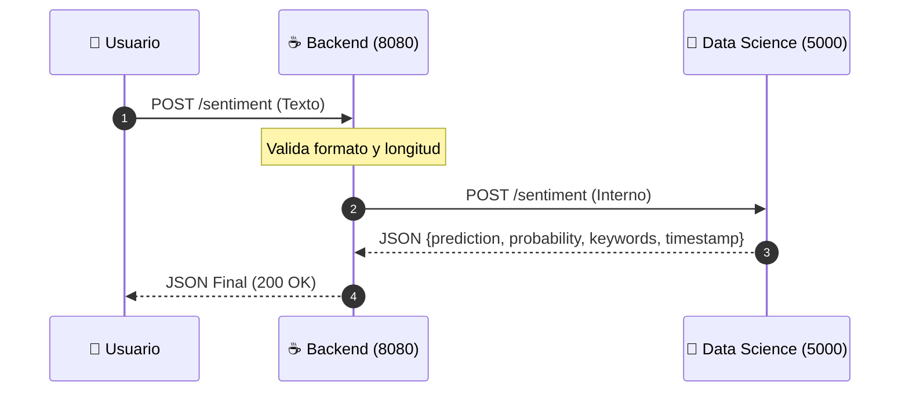

# 📜 Contrato de Interfaz (API Specification)

| Metadato    | Detalle                                 |
| :---------- | :-------------------------------------- |
| **Versión** | 1.0.1                                   |
| **Estado**  | ✅ Aprobado                             |
| **Equipos** | Data Science (Python) ↔ Back-End (Java) |

## 🧠 Arquitectura del Flujo

Este diagrama representa el flujo de datos ("Happy Path") entre los servicios:



---

## 🎯 OBJETIVO DEL CONTRATO

Este documento define el formato exacto de comunicación y reglas de negocio entre:

- **API Back-End (Java Spring Boot)** - Puerto `8080`
- **API Data Science (Python FastAPI)** - Puerto `5000`

---

## 🚀 Parte 1: API Back-End (Java → Usuario)

Es la interfaz pública que consumirá el Frontend o cliente externo.

### Endpoint Principal: Clasificar Sentimiento

- **URL:** `http://localhost:8080/sentiment`
- **Método:** `POST`
- **Content-Type:** `application/json`

### 📥 Ejemplo Request (Entrada)

```json
{
    "text": "El servicio fue excelente"
}
```

**Reglas de Validación (Java):**

1.  `text` es **OBLIGATORIO** (No null).
2.  **Longitud:** Mínimo **3**, Máximo **5000** caracteres.
3.  **Contenido:** No puede ser solo espacios en blanco.
4.  **Tipo:** Debe ser String estricto.
5.  **Encoding:** Se debe asegurar formato **UTF-8** para soportar tildes y ñ.

### 📤 Ejemplo de Response (200 OK)

```json
{
    "prediction": "Positivo",
    "probability": 0.92,
    "keywords": ["excelente", "servicio"],
    "timestamp": "2099-01-01T00:00:00Z"
}
```

**Diccionario de Datos:**
| Campo | Tipo | Descripción |
| :--- | :--- | :--- |
| `prediction` | `String` | Categoría: `"Positivo"`, `"Negativo"`, `"Neutro"`. |
| `probability` | `Float` | Confianza del modelo (0.0 a 1.0). |
| keywords | `Array[String]` | Palabras clave que influyeron en la predicción. |
| `timestamp` | `String` | Fecha ISO 8601 UTC. |

---

### ⚠️ Errores Públicos (Códigos HTTP)

Errores que el usuario final puede recibir si no cumple las reglas.

#### 🔴 Error 400: Bad Request

**Escenario: Campo 'text' vacío o ausente**

```json
{
    "error": "El campo 'text' es requerido",
    "code": 400,
    "timestamp": "2099-01-01T00:00:00Z"
}
```

**Escenario: Texto muy corto (< 3 caracteres)**

```json
{
    "error": "El texto debe tener al menos 3 caracteres",
    "code": 400,
    "timestamp": "2099-01-01T00:00:00Z"
}
```

**Escenario: Texto muy largo (> 5000 caracteres)**

```json
{
    "error": "El texto no puede exceder 5000 caracteres",
    "code": 400,
    "timestamp": "2099-01-01T00:00:00Z"
}
```

#### 🔥 Error 500: Internal Server Error

**Escenario: Fallo inesperado en el modelo o API Python**

```json
{
    "error": "Error al procesar la predicción. Intente nuevamente.",
    "code": 500,
    "timestamp": "2099-01-01T00:00:00Z"
}
```

---

## 🔌 Parte 2: API Interna (Java → Python)

Esta API es privada. El usuario final **nunca** interactúa directamente con el puerto `5000`.

### Endpoint Interno: Motor de Inferencia

- **URL Base:** `http://localhost:5000`
- **Path:** `/sentiment`
- **Método:** `POST`

### 📥 Internal Request (Java envía a Python)

Java actúa como _proxy_, limpiando el input y enviándolo al modelo.

```json
{
    "text": "Texto validado por Java"
}
```

### 📤 Internal Response (Python responde a Java)

```json
{
    "prediction": "Positivo",
    "probability": 0.98,
    "keywords": ["excelente", "servicio"],
    "timestamp": "2099-01-01T00:00:00Z"
}
```

### 🛠️ Manejo de Errores Internos

Guía para el desarrollador de Backend sobre cómo interpretar las respuestas de Python.

| Código HTTP (Python)  | Significado                                                                 | Acción Requerida en Java                                         |
| :-------------------- | :-------------------------------------------------------------------------- | :--------------------------------------------------------------- |
| **200 OK**            | Todo correcto.                                                              | Reenviar JSON al usuario.                                        |
| **422 Unprocessable** | Java envió datos que no cumplen el esquema (campo faltante o tipo erróneo). | 🐛 **Bug en Java**: Revisar el DTO o serialización hacia Python. |
| **500 Server Error**  | Python crasheó (Bug en modelo).                                             | Devolver **500** genérico al usuario.                            |
