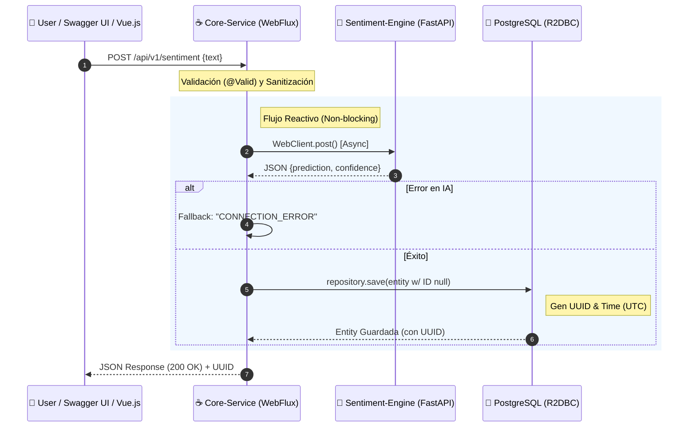

# RFC #001: Evolución a Organización de Producto y Consolidación de Arquitectura Reactiva

| Metadata         | Detalle                              |
| :--------------- | :----------------------------------- |
| **Estado**       | ✅ **FUNCIONAL (RELEASE CANDIDATE)** |
| **Organización** | **CesiumFlow**                       |
| **Versión**      | 1.0.0                                |
| **Fecha**        | 01 de Enero, 2026                    |

---

## 1. RESUMEN EJECUTIVO (ABSTRACT)

Este documento formaliza la transición técnica y estratégica de **CesiumFlow**. Abandonamos el modelo de prototipado para consolidarnos como una **Organización de Productos de Machine Learning**.

Técnicamente, se certifica la implementación exitosa de una arquitectura de microservicios 100% reactiva, segura y documentada. Hemos migrado a un stack no bloqueante (WebFlux), establecido persistencia empresarial (PostgreSQL) con generación de claves nativas y adoptado estándares de documentación viva (Swagger/OpenAPI).

---

## 2. VISIÓN ESTRATÉGICA: PRODUCTOS, NO SOLO SERVICIOS

CesiumFlow redefine su identidad. No somos una consultora de servicios aislados; somos una desarrolladora de **Productos de ML de alto valor**.

### Los 4 Pilares del Manifiesto CesiumFlow:

1.  **Atomicidad & Desacoplamiento:** Core (Java) y Engine (Python) operan independientemente; la caída de uno no compromete la integridad del sistema.
2.  **Escalabilidad Reactiva:** Infraestructura preparada para el crecimiento elástico mediante flujos asíncronos (`Mono`/`Flux`) y contenedores Docker.
3.  **Precisión & Persistencia:** Decisiones basadas en datos históricos persistidos en base de datos relacional, no en archivos volátiles.
4.  **API First (Documentación Viva):** La documentación no es un accesorio, es la puerta de entrada. Swagger UI es la interfaz principal.

---

## 3. IMPLEMENTACIÓN TÉCNICA Y ESTÁNDARES

### 3.1. Rebranding Semántico: `core-service`

Se oficializa el renombre del módulo `backend` a **`core-service`**.

-   **Justificación:** Posiciona este componente como el orquestador central, responsable de la lógica de negocio, seguridad, manejo de errores y validación, dejando a la IA solo la inferencia pura.

### 3.2. Estandarización RESTful y Swagger (OpenAPI 3)

-   **Protocolo:** Se establece `POST /api/v1/sentiment` como el estándar de industria.
-   **Documentación Viva:** Integración de **Springdoc OpenAPI 2.8.5**.
    -   La ruta raíz `/` redirige automáticamente a `swagger-ui.html`.
    -   Habilitación de "Try it out" para pruebas de humo interactivas.
    -   Exposición automática de esquemas DTO (`SentimentRequest`, `SentimentResponse`).

### 3.3. Arquitectura Reactiva: WebFlux y Resiliencia

Sustitución de `RestTemplate` por **`WebClient`**.

-   **Comunicación:** Asíncrona y no bloqueante entre Java y Python.
-   **Resiliencia:** Implementación de `onErrorResume` y bloques `try-catch` reactivos. Si el motor de IA falla, el Core responde con un estado controlado (`CONNECTION_ERROR`) en lugar de colapsar.

### 3.4. Persistencia Empresarial: PostgreSQL & R2DBC

Migración a **Spring Data R2DBC** para mantener la cadena reactiva hasta la base de datos.

-   **Estrategia de Identidad:** Se adopta la **Generación Nativa de Bases de Datos** (`DEFAULT gen_random_uuid()`).
    -   _Beneficio:_ Mantiene las Entidades Java (POJOs) limpias de lógica de infraestructura (`Persistable`) y delega la eficiencia a PostgreSQL.
-   **Estándar Temporal:** Se impone el uso de `TIMESTAMPTZ` (Timestamp with Time Zone) en el esquema SQL. Esto obliga al motor a normalizar todas las fechas a **UTC** antes de escribir en disco.

### 3.5. Seguridad y Configuración (12-Factor App)

Adopción de la metodología **The Twelve-Factor App**.

-   **Secretos:** Eliminación de credenciales en código duro. Uso de archivos `.env` (excluidos de Git) para inyectar `DB_PASSWORD`, `DB_USER` y `DB_URL`.
-   **Orquestación:** `docker-compose` inyecta estas variables en tiempo de ejecución.

### 3.6. Observabilidad y Manejo de Errores

-   **Health Checks:** Endpoints de Actuator (`/actuator/health`) integrados con los Healthchecks de Docker para reinicio automático de contenedores.
-   **Global Error Handling:** Captura centralizada de excepciones para evitar exponer "Stack Traces" al cliente final.

### 3.7. Estrategia de Datos: Modelo de Bitácora (Append-Only)

Se define arquitectónicamente el comportamiento de persistencia como un **Log de Auditoría (Audit Trail)** en lugar de un diccionario de valores únicos.

-   **Comportamiento Definido:** El sistema **permitirá duplicidad** de textos y predicciones en la base de datos. Si un usuario envía una cadena tres veces, se generarán tres registros distintos con timestamps diferentes.
-   **Justificación (ADR):**
    1.  **Trazabilidad Temporal:** Cada petición representa un evento único de usuario en un momento específico. Preservar duplicados permite análisis de frecuencia de uso.
    2.  **Rendimiento (Baja Latencia):** Se elimina la sobrecarga de realizar una lectura de verificación (`SELECT` previa) antes de la escritura (`INSERT`), garantizando una operación de persistencia **O(1)**.
    3.  **Prioridad MVP:** Se prioriza la robustez del flujo transaccional sobre la optimización del espacio en disco (_Storage is cheap, Engineering time is expensive_).

### 3.8. Soberanía Temporal (Time Authority)

Se establece al **Core-Service (Java + PostgreSQL)** como la única Fuente de la Verdad para las marcas de tiempo (`timestamps`).

-   **Cambio:** Se ignora el tiempo de inferencia reportado por el motor de IA (Python) para efectos de registro oficial.
-   **Implementación:** Uso de Auditoría Automática (`@CreatedDate` con `Instant`) para garantizar que la fecha de creación corresponda exactamente al momento de la persistencia transaccional.
-   **Justificación:** Elimina inconsistencias por desfase de relojes (_Clock Skew_) entre contenedores distribuidos y protege la integridad del historial ante datos corruptos del upstream.

---

## 4. DISEÑO DE ARQUITECTURA (FLUJO DE VALOR)

---

## 5. ROADMAP DE PRODUCTO

### 5.1. Modernización del Frontend (Vue.js)

Como parte del ecosistema de productos, se mantiene la propuesta de migración de la interfaz actual (JS puro) a **Vue.js**.

-   **Objetivo:** Construir dashboards de análisis dinámicos y modulares que consuman la API reactiva que acabamos de estabilizar.

### 5.2. Aseguramiento de Calidad (QA Inmediato)

Con la arquitectura base estabilizada, los siguientes pasos inmediatos son:

1.  **Stress Testing:** Pruebas de carga con payloads masivos (ej: textos > 1MB).
2.  **Chaos Engineering:** Simulación de caída de contenedores (`docker stop cesium-engine`) para validar la resiliencia.
3.  **Casos de Borde:** Validación de entradas vacías, caracteres especiales e inyección SQL.

### 5.3. Optimización y Caching

Una vez validada la carga transaccional, se planifica la implementación de una estrategia de **Deduplicación y Caché**.

-   **Tecnología Propuesta:** Redis.
-   **Lógica Futura:** `Check Cache -> (Hit ? Return : Predict & Save)`.
-   **Objetivo:** Reducir costos computacionales en el Engine de Python evitando re-inferencias de textos comunes.

---

## 6. IMPACTO Y GANANCIAS

-   **Mantenibilidad:** Arquitectura limpia basada en RFCs, separando claramente infraestructura (Docker) de negocio (Java).
-   **Valor de Marca:** Posicionamiento de **CesiumFlow** como una organización de alto nivel técnico, alineada con estándares de empresas como Netflix o Stripe.
-   **Seguridad:** Protección total de credenciales y datos sensibles.

---

> **ESTADO FINAL:** La implementación ha sido exitosa. El sistema está operativo, documentado y listo para las pruebas de carga.

&copy; 2026 **CesiumFlow** - _Scalability. Atomicity. Precision._
